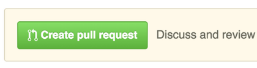

# 对FIRST FTC SDK的贡献

以下是为FIRST FTC SDK做出贡献的一系列指南。FTC技术团队欢迎对核心软件的改进建议、新功能的想法、对新传感器内置支持的请求，以及编写良好的错误报告。

## 我该如何贡献？

### 拉取请求

**停止！** 如果你是git新手，不理解分支、分支和拉取的机制，如果你刚刚读到的内容让你感到困惑，**不要**按下这个按钮。你可能不会得到你想要的结果。

如果你正在看这个按钮，那么你已经将一些更改推送到了你的团队对ftctechnh/ftc_app的分支。恭喜！你几乎肯定已经完成了。

在ftctechnh/ftc_app仓库上看到的绝大多数拉取请求并不是打算合并到官方SDK中的。团队软件就是你的团队的。它是特定于你试图完成的任务、你正在进行的测试，以及你的团队的目标。你不会希望这些被推送到官方SDK中。

如果你到目前为止读到的内容几乎没有意义，那么有一些非常好的在线git学习资源。
[Git Book](https://git-scm.com/book/en/v2)
[交互式Git教程](https://try.github.io)

### 给有经验的GIT用户的指南。

如果你非常确定你想按下上面的大绿色按钮，请继续阅读。否则，请**慢慢远离键盘**。

对于高级用户的真正意图通常是从本地分支向本地分支的master发起拉取请求，回到同一个本地分支或团队分支的子分支，而不是父分支ftctechnh/ftc_app。参见[创建拉取请求](https://help.github.com/articles/creating-a-pull-request-from-a-fork/)。

如果这确实是你的意图，那么你可以在当地通过手工将你的[主题分支](https://git-scm.com/book/en/v2/Git-Branching-Branching-Workflows#Topic-Branches)合并到master，然后再推送到github，或者如果你想要一个拉取请求来拉取同一仓库的分支之间的代码，因为，比如说，你希望团队成员在合并到master之前先查看你的软件，你可以选择“打开拉取请求”页面上的下拉菜单中的基分支，并选择你的团队仓库而不是ftctechnh的。

或者，如果你有一个从ftctechnh/ftc_app分支出来的团队仓库，然后团队成员分别从你的团队仓库分支出来，那么从个别团队成员的分支发起的拉取请求将自动选择主要团队仓库作为拉取请求的基分支。你不会不小心请求将你的团队软件拉取到ftctechnh的仓库中。

后者将是管理大型团队软件的“最佳”方式。但像所有git事物一样，有很多选择。

不属于上述类别的拉取请求将由FTC技术团队逐个案例评估。但请注意，SDK的部署模型不支持直接拉取到ftctechnh/ftc_app。

### 报告错误

本节指导你如何提交错误报告。报告越好，就越有可能找到根本原因并修复。在打开新问题时，请不要提出功能请求或软件增强。参见下面的建议增强。

#### 提交错误报告前

- 检查[论坛](http://ftcforum.firstinspires.org/forum.php)看看是否有其他人遇到了这个问题，以及是否有不需要新SDK的官方解决方案。

- 在当前[问题](https://github.com/FIRST-Tech-Challenge/FtcRobotController/issues)中搜索，看看问题是否已经被报告。如果是这样，请在现有问题上添加评论，而不是创建一个新的。

#### 如何提交（好的）错误报告？

错误被追踪为GitHub问题。在ftctechnh/ftc_app上创建一个问题，并提供以下信息。
解释问题，并包括额外的细节以帮助维护者重现问题：

- 使用清晰和描述性的标题来识别问题。

- 尽可能详细地描述重现问题的确切步骤。

- 提供具体的例子来演示步骤。

- 描述你观察到的行为，并指出该行为的确切问题。解释你期望看到的行为以及为什么。如果适用，包括显示你按照描述的步骤操作的屏幕截图，并清楚地展示问题。

- 如果你报告的是RobotController崩溃，请包括带有崩溃堆栈跟踪的日志文件。[带有堆栈跟踪的好的错误报告示例](https://github.com/ftctechnh/ftc_app/issues/224)

- 如果问题不是由特定操作触发的，描述问题发生前你正在做什么，并使用以下指南分享更多信息。

### 建议增强

FIRST的志愿者是很棒的。你们都有很棒的想法，我们想听到它们。

增强应该广泛适用于大多数团队，不应该强迫团队改变他们的工作流程，并且应该为FIRST的使命提供真正的价值，因为它涉及到吸引年轻人参与工程活动。

获得新功能支持的最佳方式是在本仓库的讨论部分发布你的创意描述。为其建立社区支持。FTC技术团队监控讨论。我们会听到你的声音，如果有足够的呼声要求这个功能，它很可能会被列入未来版本的列表。
